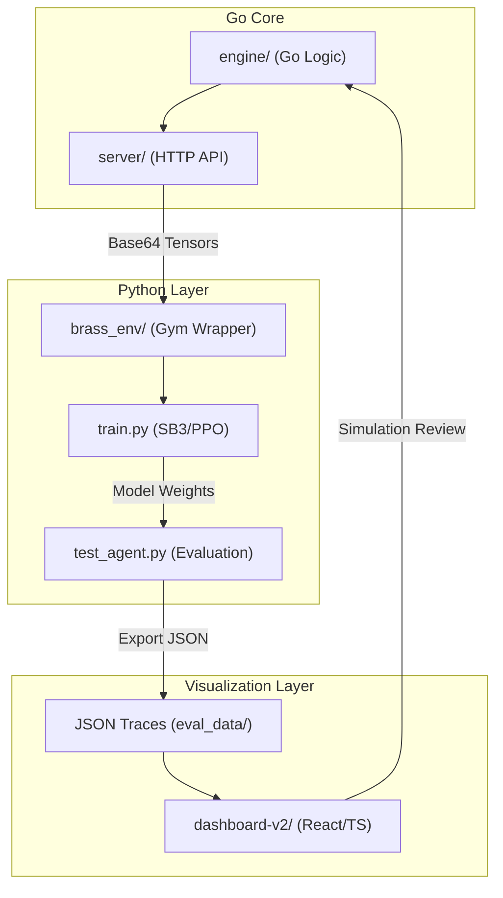

# Brass: RL Project Overview & Linkages

This repository implements a full-stack Reinforcement Learning research environment for the board game **Brass: Birmingham**. It spans a high-performance simulation engine, an HTTP API gateway, a Python-based training pipeline, and a visual analytics dashboard.

## Application Architecture

The system is composed of four primary layers:

## Linkages & Data Flow

1.  **Source of Truth (Engine → Server)**: The Go `engine` implements the authoritative game rules. The `server` exposes these rules via a low-latency HTTP API, allowing high-performance simulation without the complexity of CGO.
2.  **Training Loop (Server → Python)**: The Python `brass_env` acts as a consumer of the Go Server. It translates Go observations (raw tensors) into `numpy` arrays for the `MaskablePPO` agent.
3.  **Analytics Path (Python → Dashboard)**: When `test_agent.py` runs an evaluation, it records every state transition from the engine into a JSON "Trace."
4.  **Visual Debugging (Dashboard → Engine)**: The `dashboard-v2` consumes these traces. This allows developers to visually verify that the Go `engine` rules are being applied correctly and to understand why the Python agent chose specific strategies.

## Directory Map

- **`engine/`**: Game logic, state, and rule enforcement (Go).
- **`server/`**: API gateway for engine access (Go).
- **`python/`**: RL training, model architecture (Expert Policy), and evaluation (PyTorch/SB3).
- **`dashboard-v2/`**: Visual replay and strategy analytics (React/Vite).

## Getting Started

1.  **Run Engine**: `go run ./server` (starts engine on :8765).
2.  **Train Agent**: `cd python && uv run train.py`.
3.  **Evaluate**: `uv run test_agent.py --model runs/ppo_latest/brass_ppo_final.zip`.
4.  **Visualize**: `cd dashboard-v2 && npm run dev` (point browse to `localhost:1770`).
