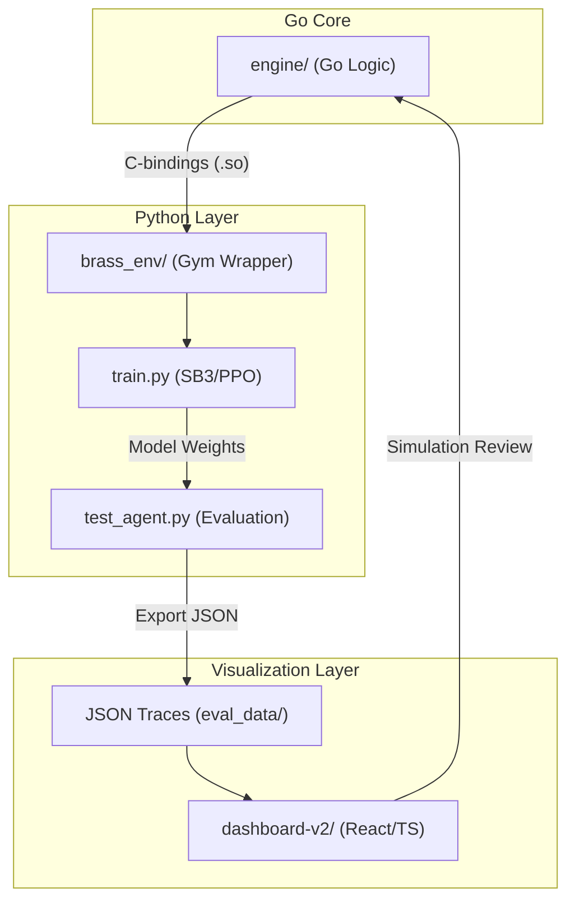

# Brass: RL Project Overview & Linkages

This repository implements a full-stack Reinforcement Learning research environment for the board game **Brass: Birmingham**. It spans a high-performance simulation engine, a Go shared library with C-bindings, a Python-based training pipeline, and a visual analytics dashboard.

## Application Architecture

The system is composed of three primary layers:

## Linkages & Data Flow

1.  **Source of Truth (Engine → Python)**: The Go `engine` implements the authoritative game rules. The shared library (`brass_engine.so`) exposes these rules via C-bindings, allowing high-performance simulation.
2.  **Training Loop**: The Python `brass_env` consumes the Go engine directly via `ctypes`. It translates Go observations into `numpy` arrays for the `MaskablePPO` agent.
3.  **Analytics Path**: When `test_agent.py` runs an evaluation, it records every state transition from the engine into a JSON "Trace."
4.  **Visual Debugging**: The `dashboard-v2` consumes these traces to visually verify engine rules and understand agent strategies.

## Agent Context & Guidelines

### Role
You are an expert developer working on the Brass Birmingham RL environment. You must maintain consistency between the Go engine and the Python RL training code.

### Tech Stack
*   **Go**: Game logic, CGO for shared library.
*   **Python 3.12+**: Stable-Baselines3, PyTorch, Gymnasium. `uv` for package management.
*   **React/TypeScript**: Dashboard.

### Commands
*   **Build Engine**: `make build`
*   **Build Shared Library**: `make build-lib`
*   **Train**: `make train` or `cd python && uv run train.py`
*   **Eval**: `make eval` or `cd python && uv run test_agent.py --model <path>`

### Code Style & Guidelines
*   **Consistency**: Keep Go engine and Python environment in sync regarding observation and action sizes.
*   **Dependencies**: Always use `uv` for Python dependencies. Set `[tool.uv] index-url = "https://pypi.org/simple"` in `pyproject.toml`.
*   **Concurrency**: Defer loading of shared library in Python to worker init functions to avoid Go runtime issues with `fork` in `SubprocVecEnv`.

### Forbidden Actions
*   Do not use `pip` directly; use `uv`.
*   Do not import `brass_env` at the top level in files that will be used with `SubprocVecEnv` before the fork.
