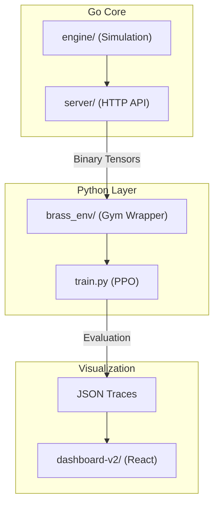

# Project Brass: Brass Birmingham RL Research Environment

A high-performance Reinforcement Learning research environment for the board game **Brass: Birmingham**. This project implements a complete pipeline from a Go-based simulation engine to a Python training framework and a React visual analytics dashboard.

## 🏗️ Architecture

The system is built as a multi-layer stack to balance high-speed simulation with flexible ML training:



## 🚀 Components

### **[Engine (Go)](./engine)**
The core game simulator written in Go for performance.
- **Rule Enforcement**: Authoritative logic for all Brass: Birmingham actions.
- **Ego-Centric Observations**: Generates flat tensors from the perspective of the active player.
- **Action Masking**: High-performance bit-masking to guide agents.

### **[Server (Go Gateway)](./server)**
A low-latency HTTP bridge that exposes the engine to Python.
- **Binary/Base64 Serialization**: Efficient transmission of state tensors and action masks.
- **Environment Pooling**: Handles concurrent game instances for parallel training.

### **[Python RL Pipeline](./python)**
State-of-the-art RL training using `stable-baselines3`.
- **Expert Compatibility Matrix**: A specialized neural architecture that solves the large structured action space (8,000+ possibilities) using dot-product compatibility.
- **Curriculum Learning**: Phases out dense rewards as performance targets are met.
- **Evaluation**: Generates full-state JSON traces for deep strategy analysis.

### **[Dashboard (Visual Analytics)](./dashboard-v2)**
A "Brass Vision" replay tool for debugging and strategy review.
- **VCR Controls**: Step-through simulation replay at any speed.
- **SVG Map**: Detailed rendering of board states, resource flows, and VP breakdowns.
- **Strategy Hub**: Aggregated heatmaps showing agent behavior patterns.

## 🚦 Quick Start

1.  **Install Dependencies**:
    ```bash
    make install
    ```
2.  **Start Engine Server**:
    ```bash
    make build
    ./main.exe
    ```
3.  **Training**:
    ```bash
    make train
    ```
4.  **Visualize Agent**:
    ```bash
    make eval
    make dashboard
    ```

---
*Documentation consolidated from internal `.AGENTS.md` files.*
